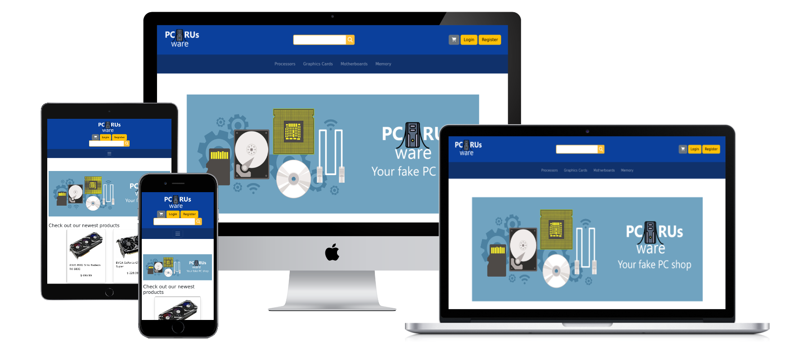
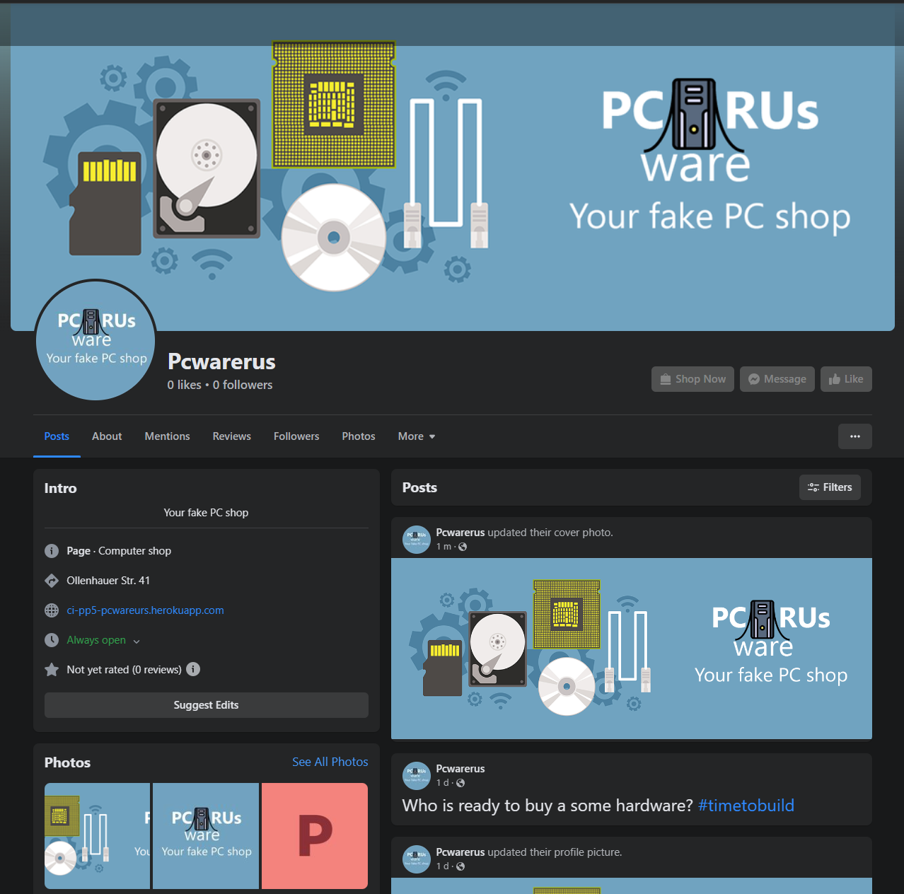
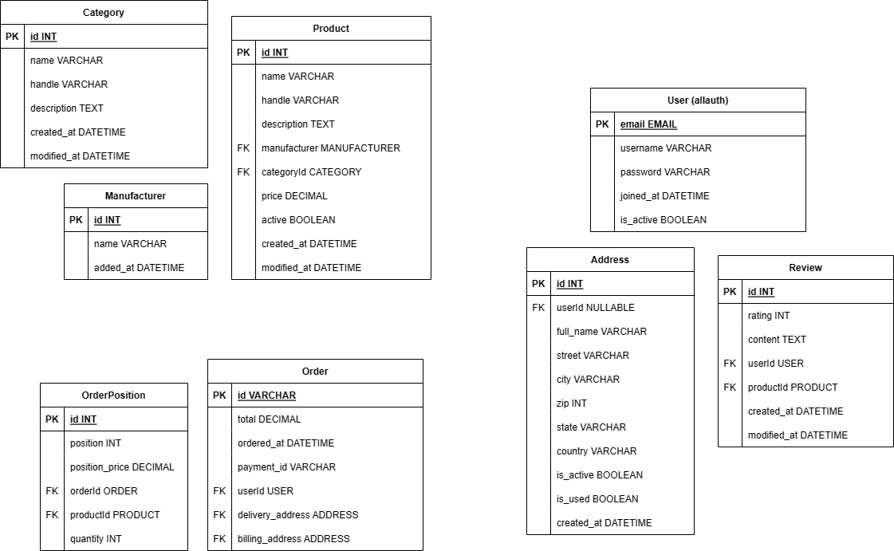
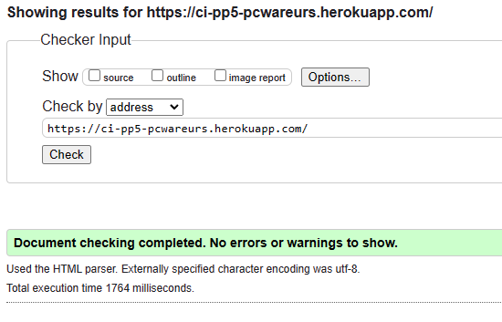
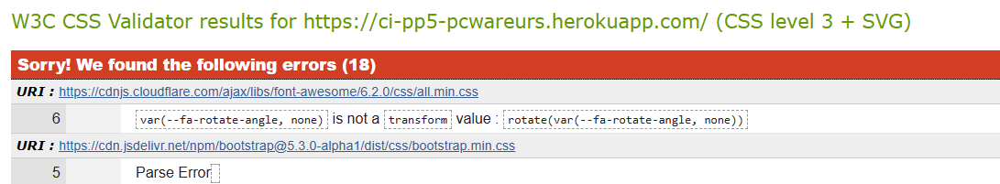
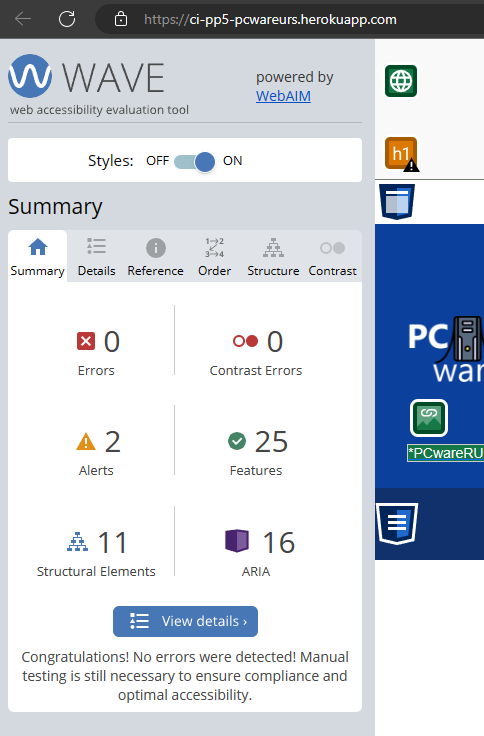
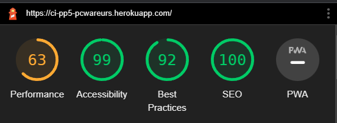

# PCwareRUs

(Developer: Robin Bosch)



[View live site](https://ci-pp5-pcwareurs.herokuapp.com/)

## Table of Content

1. [About](#about)
2. [Strategy](#strategy)
    1. [Site Owner Goals](#site-owner-goals)
    2. [User Goals](#user-goals)
    3. [Target Audience](#target-audience)
    4. [Business Model](#business-model)
    5. [SEO](#seo)
    6. [Marketing](#marketing)
3. [User Stories](#user-stories)
4. [Design](#design)
    1. [Design Choices](#design-choices)
    2. [Structure](#structure)
    3. [Database model](#database-model)
5. [Technologies Used](#technologies-used)
    1. [Languages](#languages)
    2. [Frameworks](#frameworks)
    3. [Python libraries](#python-libraries)
    4. [Tools](#tools)
6. [Features](#features)
7. [Validation and Testing](#validation-and-testing)
    1. [HTML Validation](#html-validation)
    2. [CSS Validation](#css-validation)
    3. [Python Validation](#python-validation)
    4. [Accessibility](#accessibility)
    5. [Performance](#performance)
    6. [Device testing](#device-testing)
    7. [Browser compatibility](#browser-compatibility)
    8. [Testing user stories](#testing-user-stories)
8. [Bugs](#bugs)
9. [Deployment](#deployment)
10. [Credits](#credits)
    1. [Media](#media)
    2. [Code](#code)
    3. [Acknowledgements](#acknowledgements)
11. [License](#license)

## About

PCwareRUs is a small E-Commerce B2C shop, where you can buy pc parts.
The user can browse the categories, search for products and add them to their cart.
If logged in the user can add addresses to their profile and write reviews and rate a product.
It is written in Django and uses bootstrap as CSS framework.

## Strategy

### Site Owner Goals

- Get people to buying products
- Promote own business
- Making money
- Add products

### User Goals

- Register or Login to shop
- Selecting products
- Searching for products
- Buying products
- Review product

### Target Audience

- PC enthusiasts
- Private PC builders
- People looking into building their first PC
- People who want to upgrade their current system

### Business Model

PCwareRUs is designed as a minimalistic shop for PC parts directly selling to the consumer. (B2C)

The user can order their products online and then the products will be shipped to them.

There is the possibilities for the future for discounts or the newsletter could have a lot of information about PC parts and building PCs.

More social media platforms should be considered as communication with the customer is important and can increase visibility.

### SEO

Descriptive urls have been used for the main site navigation to be more SEO friendly.

Keyword and description Meta tags have been added for SEO.

### Marketing

#### Facebook

There is a Facebook site for PCwareRUs. The shop can post new products and advertise discounts.  
[The page](https://www.facebook.com/profile.php?id=100089887771680)  
  

#### Newsletter

Users can sign up to a newsletter to stay up to date with what is happening in PCwareRUs.
  

#### Additional

There is the possibilities for more social media pages and running google ads to increase visibility.
Contests could be hosted to win prices and bring more people to join the newsletter.

## User stories

As a user I want to:

1. see an overview of all categories, so that I know what categories of products are offered.
2. see the newest items, so that I know what this shop is currently offering.
3. see the details of a product, so that I can decide if I want to buy an item.
4. be able to put in two addresses, so that I can have a delivery address and a billing address.
5. see the product list in my shopping cart, so that I know what I buy.
6. see the total for my shopping cart, so that so that I know how much I need to pay and to not exceed my budget.
7. delete products out of my shopping cart, so that I can change my opinion on something I want to buy.
8. the quantity of the products in my shopping cart, so that I can buy more or less of one product.
9. add products to my shopping cart,so that I can keep track of the items that I want to buy.
10. be able to login with one of my social media accounts, so that I don't have to remember a password for a new account.
11. see the reviews on a product, so that I know what others think about the product and if I want this product.
12. be able to register an account, so that I can set an order address and have an order history.

As a customer I want to:

13. edit a review that I have written, so that I can change my opinion about a product or update when something good or bad happened to a product.
14. delete a review that I have written, so that I can change my mind about a product.
15. view all my reviews that I have written, so that I can potentially edit them or know how many reviews I have written.
16. delete my addresses, so that I can remove outdated addresses.
17. be able to edit my addresses, so that I can make sure they are still correct.
18. see all my saved addresses, so that I know if they are still correct.
19. set multiple addresses, so that I can quickly select an address when checking out.
20. be able to reset my password, so that I can access my account if I have forgotten my password.

As a owner I want to:

21. be able to add products, so that I can expand my shop.
22. be able to edit products, so that I can correct any mistakes.
23. be able to delete products, so that they are not available in the shop anymore.

## Design

### Design Choices

The design is minimalistic. Its a simple bootstrap layout with colours and fonts from bootstrap.
The design is simple and gives a clear overview about the products.

### Structure

PCwareRUs consists of several categories and the product views. Login and Register are available.
The user has the possibility to review a product or add addresses to their account. A cart is available as slide out menu.


### Database model

#### User

- The default allauth

#### Address

- The Address field for to associate orders and users
- Contains these fields (id, user_id, full_name, street, city, zip, state, country, is_active, is_used, created_at)

#### Review

- Review for a product
- Contains these fields (id, rating, content, user_id, product_id, created_at, modified_at)

#### Category

- A category for a product
- Contains these fields (id, name, handle, description, created_at, modified_at)

#### Product

- Represents a product
- Contains these fields (id, name, handle, description, manufacturer, category, price, active, created_at, modified_at)

#### Manufacturer

- Represents a manufacturer (for normalisation)
- Contains these fields (id, name, added_at)

#### Order

- Represents an order
- Contains these fields (id, total, ordered_at, payment_id, user_id, delivery_address, billing_address)

#### OrderPosition

- Has all the products in an order
- Contains these fields (id, position, position_price, order_id, product_id, quantity)



## Technologies Used

### Languages

- HTML  
- CSS
- Python
- JavaScript

### Frameworks

- [Django](https://www.djangoproject.com/)
- [Bootstrap](https://getbootstrap.com/)
- [Font Awesome](https://fontawesome.com/icons)

### Python Libraries

- django = "*"
- stripe = "*"
- pylint = "*"
- boto3 = "*"
- django-storages = "*"
- pillow = "*"
- psycopg2 = "*"
- dj-database-url = "*"
- load-dotenv = "*"
- django-allauth = "*"
- libsass = "*"
- django-compressor = "*"
- django-sass-processor = "*"
- gunicorn = "*"
- django-crispy-forms = "*"
- django-countries = "*"

### Tools

- [Git](https://git-scm.com/)
- [GitHub](https://github.com/)
- [diagrams.net](https://www.diagrams.net/)
- [Visual Studio Code](https://code.visualstudio.com/)
- [Balsamiq](https://balsamiq.com/)

## Features

## Validation and Testing

### HTML validation

The HTML validation tests have been passed.  



### CSS validation

The full website gets errors in the CSS validation test from the font awesome framework and bootstrap.  
The own written css comes with no errors



### Python validation

The linter used was pycodestyle. There were a few lines which exceeded the 80 character limit, breaking them into new lines would always break the code.
Every other issue was fixed. Imports were sorted django generated files were not touched (came with warnings as well).

### Accessibility

All Wave accessibility tests pass with a few alerts.



### Performance

The lighthouse tests had minimal issues.
Performance can be improved by replacing the picture by more compressed ones.



### Device testing

The website was tested on the following devices:

- Windows 11 PC (Screen resolution: 2560x1440)
- Xiaomi MI 9 with Android 11 (Screen resolution: 1080x2280)

Other screen resolutions were tested in the browser with dev tools from 2560x1440 down to 320x568.

### Browser compatibility

The following browser were tested:

- Microsoft Edge (Chromium based version)
- Google Chrome
- Mozilla Firefox

Webkit based browser (Safari) could not be tested. Chromium based and Quantum based browser should be working.

### Testing user stories

#### As a user I want to

1. see an overview of all categories, so that I know what categories of products are offered.

|Feature|Action|Expected result|Actual result|
|---|---|---|---|
||||

2. see the newest items, so that I know what this shop is currently offering.
3. see the details of a product, so that I can decide if I want to buy an item.
4. be able to put in two addresses, so that I can have a delivery address and a billing address.
5. see the product list in my shopping cart, so that I know what I buy.
6. see the total for my shopping cart, so that so that I know how much I need to pay and to not exceed my budget.
7. delete products out of my shopping cart, so that I can change my opinion on something I want to buy.
8. the quantity of the products in my shopping cart, so that I can buy more or less of one product.
9. add products to my shopping cart,so that I can keep track of the items that I want to buy.
10. be able to login with one of my social media accounts, so that I don't have to remember a password for a new account.
11. see the reviews on a product, so that I know what others think about the product and if I want this product.
12. be able to register an account, so that I can set an order address and have an order history.

#### As a customer I want to:

13. edit a review that I have written, so that I can change my opinion about a product or update when something good or bad happened to a product.
14. delete a review that I have written, so that I can change my mind about a product.
15. view all my reviews that I have written, so that I can potentially edit them or know how many reviews I have written.
16. delete my addresses, so that I can remove outdated addresses.
17. be able to edit my addresses, so that I can make sure they are still correct.
18. see all my saved addresses, so that I know if they are still correct.
19. set multiple addresses, so that I can quickly select an address when checking out.
20. be able to reset my password, so that I can access my account if I have forgotten my password.

#### As a owner I want to:

21. be able to add products, so that I can expand my shop.
22. be able to edit products, so that I can correct any mistakes.
23. be able to delete products, so that they are not available in the shop anymore.


## Bugs

|Status|Bug|Fix|
|---|---|---|
||||

## Deployment

1. Follow the clone steps below and go to step 2
2. Run the following command to install all required packages

```
pipenv install
```

3. Create a .env file and add the following keys to it:
    - STRIPE_SECRET_KEY --> Stripe secret key
    - STRIPE_PUBLIC_KEY --> Stripe public key
    - STRIPE_WH_SECRET --> Stripe webhook secret
    - AWS_ACCESS_KEY_ID --> The AWS access key
    - AWS_SECRET_ACCESS_KEY --> The AWS secret key
    - DATABASE_URL --> Your link to your postgres database
    - DEBUG --> Set either to True or False
    - EMAIL_HOST_USER --> Your email host (address)
    - EMAIL_HOST_PASS --> Your email password for programatic access
    - SECRET_KEY --> A random secret key, can be anything

4. Enter the following command to start up the server:

```
pipenv shell
cd pcwareurs
python3 manage.py runserver
```

5. The package can now be accessed locally under [localhost:8000](https://localhost:8000)
6. Don't forget to create a super user to access the admin panel with the following command:

```
python3 manage.py createsuperuser
```

Heroku:

1. Create an account at Heroku and login.
2. Click the "Create new app" button on your dashboard, add app name and region.
3. Click on the "Create app" button.
4. Click on the "Settings" tab.
5. Under "Config Vars" click "Reveal Config Vars" add the following keys:
    - STRIPE_SECRET_KEY --> Stripe secret key
    - STRIPE_PUBLIC_KEY --> Stripe public key
    - STRIPE_WH_SECRET --> Stripe webhook secret
    - AWS_ACCESS_KEY_ID --> The AWS access key
    - AWS_SECRET_ACCESS_KEY --> The AWS secret key
    - DATABASE_URL --> Your link to your postgres database
    - DEBUG --> Set either to True or False
    - EMAIL_HOST_USER --> Your email host (address)
    - EMAIL_HOST_PASS --> Your email password for programatic access
    - SECRET_KEY --> A random secret key, can be anything
6. Under "Buildpacks" click "Add buildpack" and then choose "Python" first and click "Save changes"
7. Go to the "Deploy" tab and choose GitHub as your deployment method
8. Connect your GitHub account
9. Enter your repository name, search for it and click connect when it appears below.
10. In the manual deploy section click "Deploy branch"
11. Optional: You can enable automatic deploys if you want the app to automatically update

You can fork the repository by following these steps:

1. Go to the repository on GitHub  
2. Click on the "Fork" button in the upper right hand corner

You can clone the repository by following these steps:

1. Go to the repository on GitHub
2. Locate the "Code" button above the list of files and click it  
3. Select if you prefer to clone using HTTPS, SSH, or Github CLI and click the "copy" button to copy the URL to your clipboard
4. Open Git Bash
5. Change the current working directory to the one where you want the cloned directory
6. Type git clone and paste the URL from the clipboard ($ git clone <https://github.com/YOUR-USERNAME/YOUR-REPOSITORY>)  
7. Press Enter to create your local clone.

## Credits

### Media

The following PC icon in the logo and icon was used:  
[PC Icon](https://www.flaticon.com/free-icon/computer-tower_9214538?term=pc&page=1&position=34&origin=tag&related_id=9214538)

The following banner was used on the social media and webpage:  
[Banner](https://www.freepik.com/free-vector/pc-computer-equipment-with-devices-accessories-flat-banner-set-isolated_2869541.htm#query=computer%20hardware%20banner&position=1&from_view=keyword)

Icons are taken from Font Awesome:  
[FontAwesome](<https://fontawesome.com/>)

Shop images are all taken from the price comparison site geizhals.de:  
[Website](https://geizhals.de/)

### Code

The Privacy Policy was generated by a generator  
[Generator](https://www.privacypolicytemplate.net)

Terms and Conditions were generate by a generator  
[Generator](https://www.termsandconditionsgenerator.com/)

Stripes quickstart was used for the payment element  
[Quickstart](https://stripe.com/docs/payments/quickstart)

The stripe webhandler from the boutique ado repository was used  
[Repository](https://github.com/ckz8780/boutique_ado_v1)

CSS Reset has been used in the reset.css file.  
It was written by Andy Bell in a blog post:  
[Blog post](<https://piccalil.li/blog/a-modern-css-reset/>)

Guides on Flexbox and Grid from CSS-Tricks, that have been used multiple times as a reference.  
[Complete Guide to Grid](<https://css-tricks.com/snippets/css/complete-guide-grid/>)  
[Complete Guide to Flexbox](<https://css-tricks.com/snippets/css/a-guide-to-flexbox/>)

### Acknowledgements

- A special thanks to my mentor Mo Shami for his feedback and advice, especially on the documentation.
- A thanks to the Code Institute for the great learning resources

## License

This project is published under the MIT license.  
[License](/LICENSE.txt)